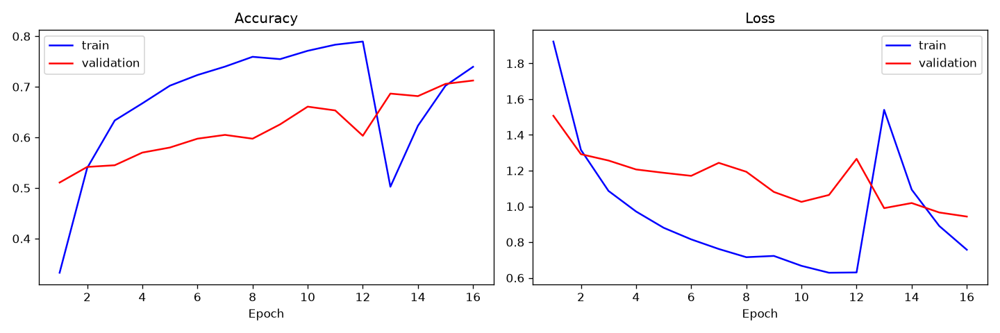
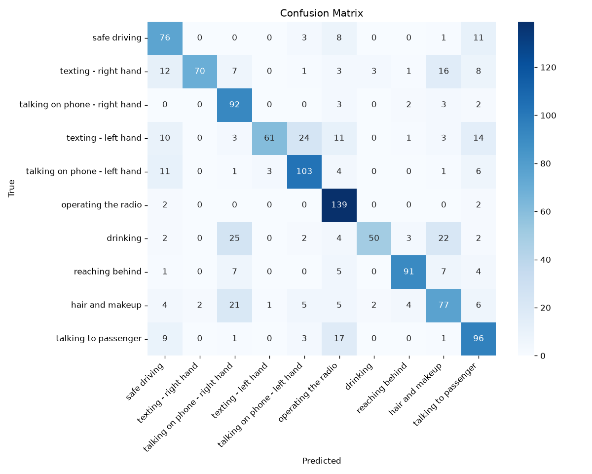
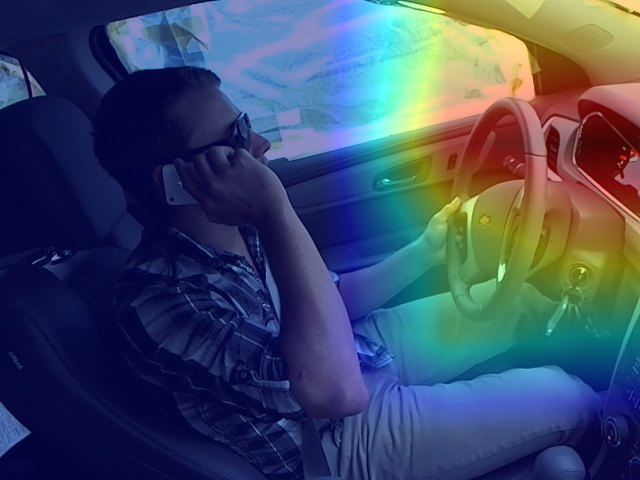

# 🚗 Driver Distraction Classification using CNNs

An end-to-end deep-learning system that detects **distracted driving** from a
dashboard-camera image and classifies the driver's behavior into **10 classes**.
The project combines a **custom CNN baseline**, **transfer learning**
(MobileNetV2 / EfficientNetB0), **Grad-CAM explainability**, and an interactive
**Streamlit dashboard** that reports the behavior, a confidence score, a
**risk level (SAFE / MEDIUM / HIGH)** and a recommended safety action.

> **Built with:** Python · TensorFlow/Keras · OpenCV · scikit-learn · Streamlit

---

## 📌 Project Overview

Distracted driving is one of the leading causes of road accidents. A camera
mounted on the dashboard can monitor the driver and flag dangerous behavior in
real time. This project builds the perception model behind such a system: given
a single driver image, it predicts what the driver is doing and how risky it is.

## 🎯 Problem Statement

Given a dashboard-camera image of a driver, classify it into one of 10
behaviors and produce an actionable risk assessment:

| Code | Behavior | Risk |
|------|----------|------|
| c0 | safe driving | SAFE |
| c1 | texting — right hand | HIGH |
| c2 | talking on phone — right hand | HIGH |
| c3 | texting — left hand | HIGH |
| c4 | talking on phone — left hand | HIGH |
| c5 | operating the radio | MEDIUM |
| c6 | drinking | MEDIUM |
| c7 | reaching behind | HIGH |
| c8 | hair and makeup | MEDIUM |
| c9 | talking to passenger | MEDIUM |

## 📂 Dataset

**State Farm Distracted Driver Detection** (Kaggle):
https://www.kaggle.com/c/state-farm-distracted-driver-detection

- ~22,000 labeled training images across the 10 classes above.
- Color images of drivers captured from a fixed in-car camera angle.
- The dataset is **not bundled** in this repo. See [`data/README.md`](data/README.md)
  for download and folder-layout instructions.

## 🧪 Methodology

1. **Data loading & split** — images are read from class subfolders; an 80/20
   train/validation split is created on the fly.
2. **Preprocessing** — resize to 224×224 and scale pixels to `[0, 1]` (a single
   shared code path so training and inference always match).
3. **Data augmentation** — random rotations, shifts, zoom and brightness jitter
   to expand the effective dataset and reduce overfitting.
4. **Modeling** — a custom CNN baseline plus a transfer-learning model.
5. **Two-stage training** — train with a frozen ImageNet backbone, then
   fine-tune the top layers at a low learning rate.
6. **Regularization** — dropout, batch-norm, early stopping, LR scheduling and
   class weighting.
7. **Evaluation** — accuracy, macro precision/recall/F1, confusion matrix and a
   full classification report.
8. **Explainability** — Grad-CAM heatmaps to verify the model looks at the
   right regions (hands, phone, wheel).

## 🏗️ Model Architecture

**Custom CNN baseline** — 4 convolutional blocks
(`Conv → BatchNorm → MaxPool`, 32→64→128→128 filters) followed by global
average pooling, a dense layer, dropout and a 10-way softmax.

**Transfer-learning model** — a pretrained **MobileNetV2** (or
**EfficientNetB0**) backbone with its classifier removed, topped with:

```
Backbone (ImageNet, frozen → partially fine-tuned)
    → GlobalAveragePooling2D
    → Dense(256, relu)
    → Dropout(0.3)
    → Dense(10, softmax)
```

The architecture is selected in [`config.yaml`](config.yaml) via
`model.architecture` (`custom_cnn` | `mobilenetv2` | `efficientnetb0`).

## 📊 Results

Trained with **MobileNetV2 transfer learning** (frozen backbone for 12 epochs,
then 4 epochs of fine-tuning) at **160×160** on a **balanced 6,000-image subset**
(600 images/class) of the real State Farm training set, evaluated on a held-out
20% validation split.

| Metric | Score |
|--------|-------|
| Accuracy | **0.713** |
| Macro Precision | **0.755** |
| Macro Recall | **0.711** |
| Macro F1-score | **0.705** |

Per-class F1 (hardest vs. easiest behaviors):

| Class | F1 | | Class | F1 |
|-------|----|----|-------|----|
| operating the radio | 0.81 | | hair and makeup | 0.60 |
| reaching behind | 0.84 | | drinking | 0.61 |
| talking on phone (L) | 0.76 | | texting (L) | 0.64 |

The confusion matrix shows physically sensible mistakes — *drinking* is confused
with *phone* and *hair/makeup* (all hand-near-face poses), and *texting-left*
with *phone-left* (both left-hand-up). See `outputs/confusion_matrix.png`.

**Reproducibility note.** These numbers come from a 6k-image subset at 160px to
keep CPU training to ~10 minutes. Training on the full 22k images at 224px for
more epochs (and on a GPU) will raise accuracy. Also, the train/val split is
random, so the same driver can appear in both sets — this inflates validation
accuracy somewhat. A **driver-aware split** (using `driver_imgs_list.csv`) is
the rigorous evaluation and is listed under Future Improvements.

### Visual results

Training curves — frozen transfer stage, then fine-tuning:



Confusion matrix — strong diagonal with human-like confusions (drinking ↔ phone ↔ hair):



Grad-CAM — the model focuses on the phone/hand region of a real driver:



Generated artifacts (in `outputs/`):

- `outputs/training_curves.png` — accuracy & loss curves
- `outputs/confusion_matrix.png` — confusion matrix
- `outputs/per_class_f1.png` — per-class F1 scores
- `outputs/classification_report.txt` — full per-class precision/recall/F1
- `outputs/metrics.json` — machine-readable summary
- `outputs/gradcam_example.png` — Grad-CAM overlay on a real driver image

## ⚙️ How to Run Locally

```bash
# 1. Clone and enter the project
git clone <your-repo-url>
cd Driver-Distraction-Classification-CNN

# 2. Install dependencies (use a virtual environment)
python -m venv .venv && source .venv/bin/activate
pip install -r requirements.txt

# 3. Download the dataset into data/  (see data/README.md)

# 4. Train (two-stage: frozen backbone + fine-tuning)
python -m src.train --config config.yaml

# 5. Evaluate — writes metrics, plots and the confusion matrix to outputs/
python -m src.evaluate --config config.yaml \
    --model models/driver_distraction_model.keras

# 6. Predict a single image from the CLI
python -m src.predict --image path/to/driver.jpg \
    --model models/driver_distraction_model.keras

# 7. Launch the dashboard
streamlit run app/dashboard.py
```

## 🗂️ Folder Structure

```
Driver-Distraction-Classification-CNN/
├── README.md
├── requirements.txt
├── config.yaml                 # Single source of truth for all settings
├── .gitignore
├── data/
│   └── README.md               # Dataset download + layout instructions
├── notebooks/
│   └── 01_exploratory_data_analysis.ipynb
├── src/
│   ├── utils.py                # Config loading & helpers
│   ├── preprocess.py           # Shared image preprocessing
│   ├── data_loader.py          # Augmented train/val generators
│   ├── model.py                # Custom CNN + transfer-learning models
│   ├── train.py                # Two-stage training pipeline
│   ├── evaluate.py             # Metrics, report, confusion matrix, plots
│   ├── gradcam.py              # Grad-CAM heatmap generation & overlay
│   └── predict.py              # Single-image inference + risk assessment
├── app/
│   └── dashboard.py            # Streamlit app
├── models/                     # Saved models (git-ignored)
└── outputs/                    # Plots, metrics, reports (git-ignored)
```

## 🧠 Concepts Explained (Interview-Friendly)

**CNN (Convolutional Neural Network).** A neural network that slides small
learnable filters over an image to detect patterns — edges first, then
textures, then object parts. Stacking these layers lets the model build up from
"there's an edge here" to "this is a hand holding a phone".

**Transfer learning.** Instead of training from scratch, we reuse a network
(MobileNetV2/EfficientNetB0) already trained on millions of ImageNet images. It
already knows generic visual features, so we only retrain the final layers on
our driver images. This gives higher accuracy with far less data and compute.

**Data augmentation.** During training we randomly rotate, shift, zoom and
brighten images. The model sees a slightly different version each epoch, which
makes it more robust and prevents it from memorizing specific pixels.

**Overfitting control.** Overfitting is when a model memorizes the training set
but fails on new data. We fight it with dropout (randomly disabling neurons),
batch normalization, data augmentation, **early stopping** (stop when validation
loss stops improving) and a learning-rate scheduler.

**Confusion matrix.** A 10×10 grid showing, for each true class, how many
images were predicted as each class. The diagonal is correct predictions;
off-diagonal cells reveal which behaviors get confused (e.g. texting vs.
phone calls).

**Macro F1-score.** F1 is the harmonic mean of precision and recall.
"Macro" means we average the F1 of every class equally, so rare classes count
as much as common ones — important when classes are imbalanced.

**Grad-CAM.** A technique that highlights the image regions most responsible
for a prediction, producing a heatmap. If the model says "texting" because it
focused on the phone in the driver's hand, we can trust it; if it focused on the
background, we know something is wrong.

## 🚀 Future Improvements

- Real-time video inference (per-frame + temporal smoothing).
- Driver-aware cross-validation (split by driver ID to avoid leakage).
- Model quantization / TFLite export for on-device (edge) deployment.
- Ensemble of EfficientNet variants for higher accuracy.
- Calibrated confidence scores for safer thresholding.
- Test-time augmentation and label-smoothing.

## 📝 CV / Resume Entry

**Driver Distraction Classification using CNNs | Python, TensorFlow, CNN, EfficientNet, Grad-CAM**

- Built an image-classification pipeline to detect 10 driver behaviors including safe driving, texting and phone usage.
- Fine-tuned EfficientNet/MobileNet with data augmentation, evaluating accuracy, macro F1-score and confusion matrix.
- Added Grad-CAM visual explanations and a Streamlit dashboard to show class confidence, risk level and safety intervention.

---

*Educational / portfolio project. Not a certified safety system — do not deploy
as a sole driver-monitoring solution without rigorous validation.*
